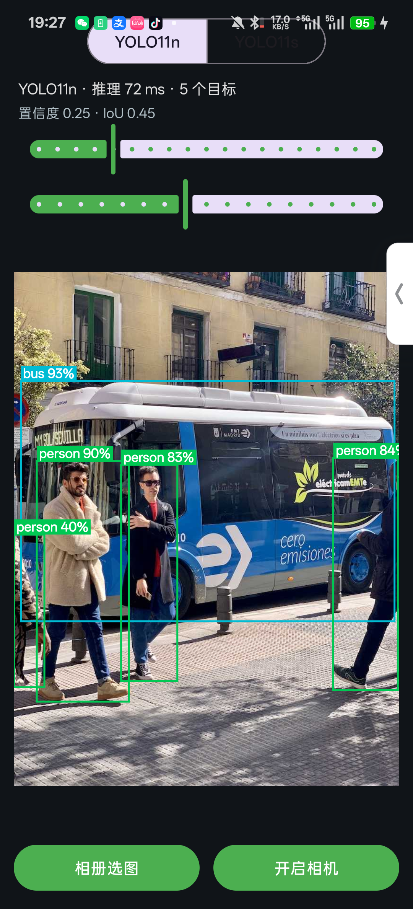
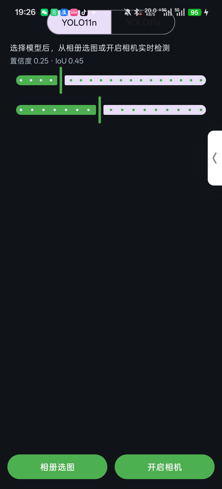

# YOLO11 MNN Android Demo

基于 [MNN](https://github.com/alibaba/MNN) 推理引擎的 YOLO11 on-device 目标检测 Android demo，支持 **YOLO11n / YOLO11s 运行时切换**、**相册选图**与 **CameraX 实时检测**两种模式，检测阈值 App 内可调。


## 效果

| 检测结果（YOLO11n · 72ms · bus 93% + 4×person） | 主界面（模型切换 + 阈值滑块） |
|:---:|:---:|
|  |  |

> 📦 直接安装体验：到 [Releases](https://github.com/xxddccaa/yolo11-mnn-android/releases/latest) 下载 APK（arm64-v8a，模型已内置，装完即用）。

## 特性

- 🎯 **两个模型运行时切换**：YOLO11n（2.8 MB）/ YOLO11s（9.3 MB），一键切换看精度/速度差异
- 📷 **双输入模式**：相册静态图检测 + CameraX 实时相机检测（含 FPS / 推理耗时）
- 🎚️ **阈值可调**：置信度与 IoU(NMS) 滑块，实时生效
- 🧩 **独立 AAR 模块**：检测核心封装在 `:yolo` 库模块，可被其它 App 直接复用
- ⚡ **INT8 权重量化**：体积减半、精度近乎无损（vs 原始 ONNX 检测框 100% 一致、分数差 <0.003）
- 📦 **模型内置**：`.mnn` 打包进 APK assets，装完即用、无需联网

## 技术栈

- **模型**：YOLO11n / YOLO11s（COCO 80 类，输入 640×640）
- **推理**：MNN 3.6（CPU 后端，4 线程）
- **相机**：CameraX
- **语言**：Kotlin + C++（JNI）
- **最低 SDK**：API 26（Android 8.0），仅 arm64-v8a

## 工程结构

```
.
├── app/                        # 应用模块（UI / 相机 / 相册）
│   └── src/main/
│       ├── assets/             # yolo11n.mnn, yolo11s.mnn（内置模型）
│       └── kotlin/com/yolomnn/demo/
│           ├── MainActivity.kt        # 模型切换 + 双模式 + 阈值滑块
│           ├── DetectionOverlay.kt    # 检测框 + 类别 + 置信度绘制
│           ├── ImageUtils.kt          # CameraX 帧 -> Bitmap
│           └── ModelAssets.kt         # assets 模型抽取到 cache
├── yolo/                       # 独立 AAR 库模块（检测核心）
│   └── src/main/
│       ├── cpp/                # yolo_jni.cpp + CMakeLists（MNN JNI 桥）
│       ├── jniLibs/arm64-v8a/  # 预编译 libMNN.so
│       └── kotlin/com/yolomnn/
│           ├── YoloDetector.kt        # letterbox / 推理 / decode / NMS
│           ├── Detection.kt
│           └── CocoLabels.kt
├── third_party/mnn/include/    # MNN 头文件
└── tools/                      # 模型导出 / 转换 / 自测脚本
    ├── export_yolo.py          # ultralytics 导出 ONNX
    ├── convert_mnn.sh          # ONNX -> MNN（权重 INT8）
    └── test_mnn_infer.py       # MNN vs ONNX 检测一致性自测
```

## 构建

```bash
# 需要 Android SDK（compileSdk 36）、NDK、JDK 17
echo "sdk.dir=/path/to/android-sdk" > local.properties
./gradlew :app:assembleDebug
# 产物：app/build/outputs/apk/debug/app-debug.apk
```

将 `:yolo` 作为库发布到本地 Maven：`./gradlew :yolo:publishToMavenLocal`。

## 复用 `:yolo` 检测器

```kotlin
val detector = YoloDetector()
detector.loadModel("/path/to/yolo11n.mnn")
val result = detector.detect(bitmap, confThreshold = 0.25f, iouThreshold = 0.45f)
result.detections.forEach { d -> /* d.box, d.label, d.score */ }
detector.close()
```

## 模型转换流程（tools/）

1. `python tools/export_yolo.py` —— ultralytics 导出 `yolo11n.onnx` / `yolo11s.onnx`
2. `MNN_SRC=<mnn源码> bash tools/convert_mnn.sh yolo11n.onnx yolo11s.onnx` —— 转 `.mnn`，权重 INT8 量化
3. `python tools/test_mnn_infer.py --onnx yolo11n.onnx --mnn yolo11n.mnn --img bus.jpg` —— 验证量化精度

## 预处理说明

采用官方 ultralytics letterbox：等比缩放（`ratio = min(640/w, 640/h)`）后居中贴到
640×640 画布、灰边填充 114；`/255` 归一化；输出 `[1,84,8400]` 解码为 `[cx,cy,w,h,80类]`，
经置信度过滤 + 类无关 NMS，坐标 `((coord - pad) / ratio)` 反算回原图。

## 致谢

- [alibaba/MNN](https://github.com/alibaba/MNN) —— 推理引擎
- [ultralytics](https://github.com/ultralytics/ultralytics) —— YOLO11 模型与导出
- [wangzhaode/mnn-yolo](https://github.com/wangzhaode/mnn-yolo) —— YOLO+MNN decode 参考实现

## License

Apache-2.0
